I recently migrated DNS service for this domain to Route 53. Doing so meant I couldn't use Google Domains to forward emails sent to addresses on the domain. [Mailgun](https://mailgun.com) turned out to be a solid, free alternative for both receiving and sending email using a custom domain.

## Receiving Email

Begin by [signing up](https://mailgun.com/signup) for a Mailgun account. Mailgun will process 10,000 sent or received messages a month for free. You can also use your free account to register up to five custom domains.

Once you've signed up and activated your account, navigate to your Mailgun [dashboard](https://mailgun.com/app/dashboard). In the nav bar, click "Domains."

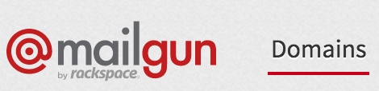

Click "Add New Domain." In the form that follows, enter your domain (e.g., "example.com"). Mailgun recommends using a subdomain, but if you do this, you'll have problems receiving email. If you were to provide "mail.example.com" as your domain name, you'd be able to send email, say from "you@mail.example.com," but you wouldn't be able to receive email at "you@example.com."

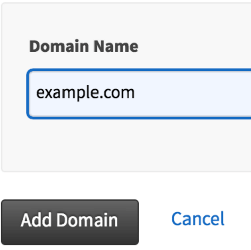

When you've entered your domain name, click "Add Domain." Next, follow Mailgun's directions for verifying ownership of your domain. This will require visiting your DNS provider (e.g., Route 53) and adding the `TXT`, `CNAME`, and `MX` records provided to you by Mailgun. Once you've done so, you can force Mailgun to check for the new DNS records using the "Check DNS Records Now" button. Note that it may take several hours for new DNS records to propagate, so prepare to be patient.

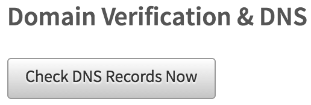

Mailgun can start receiving emails sent to your domain as soon as your domain is verified. However, you probably want those emails forwarded to a service like Gmail which you use every day. To do this, you need to create a Mailgun "route." Click "Routes" in the nav bar.

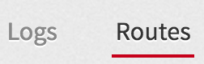

Click "Create Route." In the form that follows:

1. Select "Match Recipient" as the "Expression Type."

2. Set the "Recipient" as the email address you want others to send mail to (e.g., "you@example.com").

3. Under "Actions," check the box next to "Forward," and enter your personal Gmail address (e.g., "you@gmail.com").

4. Set a low "Priority," such as 1.

Here's what the form should look like when filled out.

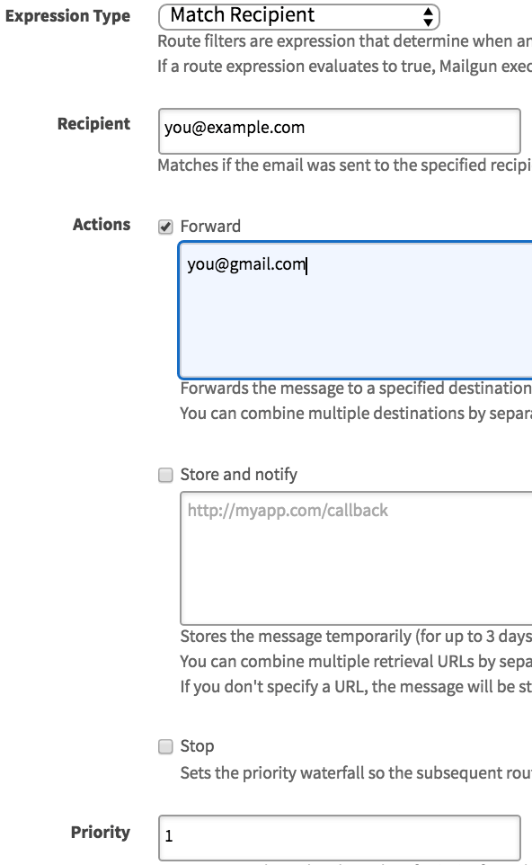

If you're satisfied, click "Create Route." Emails addressed to "you@example.com" will now be forwarded to "you@gmail.com."

## Sending Email

Receiving email at your custom domain is nice, but you probably want to be able to send email from it, too. Here's how to do that with Gmail.

Start by navigating to your Mailgun domain details page, at https://mailgun.com/app/domains/example.com. You're looking for the "Domain Information" section, pictured below.

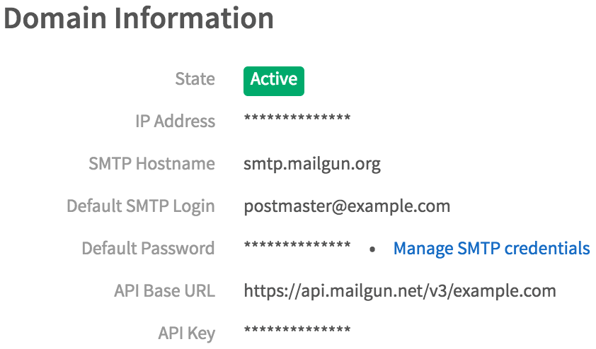

Make note of the `SMTP Hostname`, `Default SMTP Login`, and `Default Password`. You'll need them shortly.

Over in Gmail, click the gear icon in the upper right of your inbox and select "Settings" from the menu.

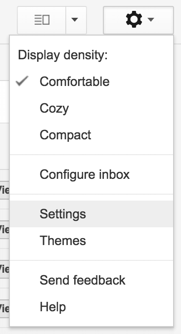

Select the "Accounts and Import" tab. In the "Send mail as" section, click the "Add another email address you own" link.

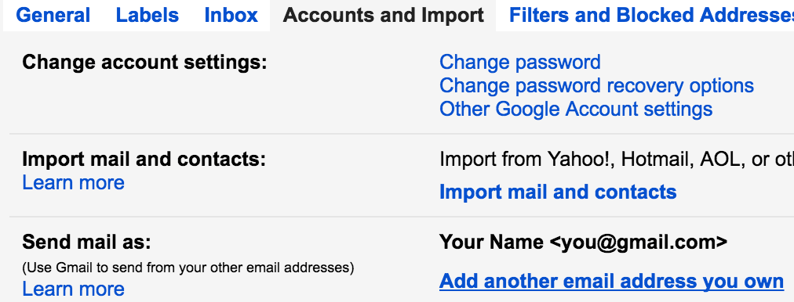

Provide your name, the email address you set up in Mailgun above (e.g., "you@example.com"), and leave the box next to "Treat as an alias" checked.

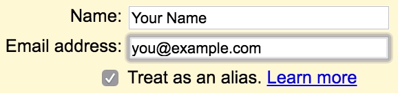

Click "Next Step." Now you need those three fields from the Mailgun "Domain Information" section. Provide the Mailgun `SMTP Hostname` as the "SMTP Server," the Mailgun `Default SMTP Login` as the "Username," and as the Mailgun `Default Password` as the "Password." Leave the bubble next to "Secured connection using TLS" selected, and leave the port as 587. When you're satisfied, click "Add Account."

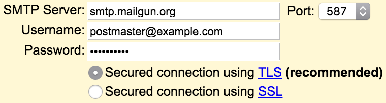

You'll then be asked to verify ownership of the email address by following a link in a verification email sent to the address, or by entering a code contained in that message. Once you do either, you should see your new email address listed in the "Send mail as" section.

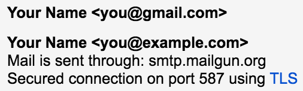

You can now select your new email address when composing Gmail messages.

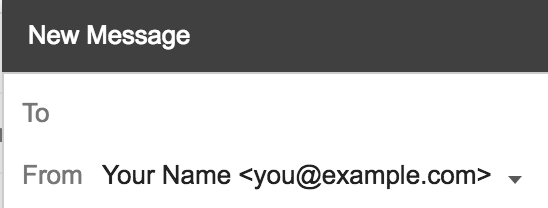

Congratulations! You can now send and receive email using an address on your own domain.
