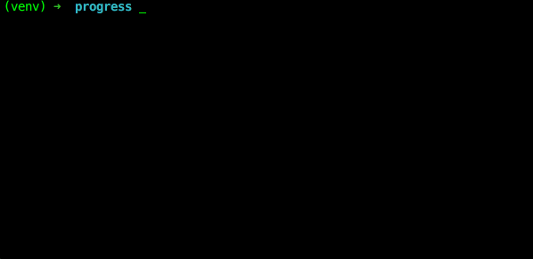

Need to keep an eye on the progress of parallelized tasks? If you're using Python's [`concurrent.futures`](https://docs.python.org/3/library/concurrent.futures.html) module, one way to do it is with [`tqdm`](https://pypi.python.org/pypi/tqdm), a nice package for generating progress bars. Here's how it looks.



And here's the code for `progress.py`.

```python
from concurrent.futures import ProcessPoolExecutor, as_completed
import time

from tqdm import tqdm


def nap():
    time.sleep(1)


def main():
    with ProcessPoolExecutor() as executor:
        futures = [executor.submit(nap) for i in range(100)]

        kwargs = {
            'total': len(futures),
            'unit': 'nap',
            'unit_scale': True,
            'leave': True
        }

        for f in tqdm(as_completed(futures), **kwargs):
            pass


if __name__ == '__main__':
    main()
```

Since [`as_completed()`](https://docs.python.org/3/library/concurrent.futures.html#concurrent.futures.as_completed) does not provide a `__len__` method yielding the count of [`Future`](https://docs.python.org/3/library/concurrent.futures.html#concurrent.futures.Future) instances to be executed, we need to tell `tqdm` how much work we expect to be done using the `total` parameter.
