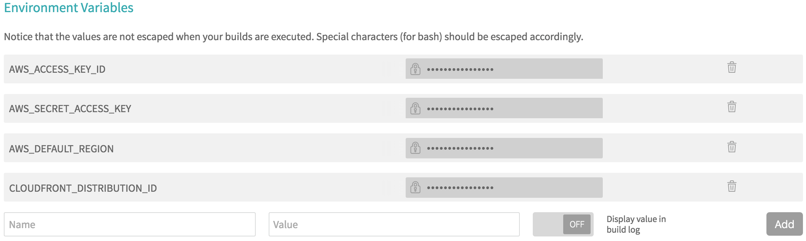

You can use Travis to quickly and easily deploy a static site to S3 and invalidate a corresponding CloudFront distribution. Here's how.

## Assumptions

I'm assuming you already have a static site set up on S3 and CloudFront. If you don't and are interested in learning how, David Baumgold has a great [tutorial for how to make a static site on S3 and CloudFront](https://www.davidbaumgold.com/tutorials/deploy-static-site-aws-s3-cloudfront/).

I'm also assuming the source for your site is hosted publicly on GitHub so you can use Travis, a free continuous integration platform for GitHub projects.

## IAM User

Start by making AWS credentials for Travis. Do this by creating an [IAM](https://docs.aws.amazon.com/IAM/latest/UserGuide/best-practices.html) user. From the AWS Management Console, navigate to the "Security Credentials" page.


You may be presented with a modal encouraging you to create IAM users. Dismiss it by clicking "Continue to Security Credentials."


In the sidebar, navigate to "Users."


Click "Create New Users."


Enter a username for your Travis user and click "Create" in the lower right. I use the name "travis" so it's clear what the user is for.


The next page will display security credentials for your new user, initially collapsed. These are important, and are only displayed once. If you lose them, you'll need to generate new credentials. Keep them somewhere safe. We'll return to them shortly.


Once you've saved a copy of your user's credentials, close the page using the link in the bottom right.

Now you need to grant your newly-created IAM user permission to access S3 (so it can upload files) and permission to access CloudFront (so it can invalidate distributions). This approach follows the principle of [least privilege](https://docs.aws.amazon.com/IAM/latest/UserGuide/best-practices.html#grant-least-privilege). In other words, you only grant this user the smallest set permissions necessary for it to do its job.

Click on the row for your IAM user in the listing, highlighted in blue below.


Select the "Permissions" tab, then click "Attach Policy."


Use the filter in the form that follows to select the "AmazonS3FullAccess" and "CloudFrontFullAccess" policies, checking the boxes next to each. Then click "Attach Policy" in the bottom right. If you did it correctly, you should see the following:


Your IAM user is now ready to go! Next, you'll configure Travis.

## Travis Repo Settings

Navigate to your Travis profile page at `https://travis-ci.org/profile/<your GitHub username>`. In the list of public repositories, make sure Travis is enabled for the repo containing the source for your site.


Click the gear icon next to the repo name to view settings for the repo. General settings should appear as follows:


Now define the following environment variables which your builds will be able to access. When doing this, make sure that the "Display value in build log" toggle is off for each new variable. You don't want to leak sensitive information into your build logs.



The names of the `AWS_ACCESS_KEY_ID`, `AWS_SECRET_ACCESS_KEY`, and `AWS_DEFAULT_REGION` variables are important. These are used to configure the [AWS CLI](https://pypi.python.org/pypi/awscli), a Python package you'll use to invalidate CloudFront distributions.

Set `AWS_ACCESS_KEY_ID` and `AWS_SECRET_ACCESS_KEY` using the security credentials for your IAM user. Set `AWS_DEFAULT_REGION` to `us-east-1` for the US East (N. Virginia) region. This is [required](https://docs.aws.amazon.com/general/latest/gr/rande.html#cf_region) in order to submit requests to CloudFront programmatically. Finally, set `CLOUDFRONT_DISTRIBUTION_ID` to the ID of the CloudFront distribution whose origin is the S3 bucket hosting your site.

You're halfway to configuring Travis for deployment. The last step is the addition or modification of a `.travis.yml` file.

## .travis.yml

Travis uses a `.travis.yml` file at the root of your repository to learn about how you want your builds run. Let's break down the options you need to define for S3 deployment and CloudFront invalidation. For a working example, see [my .travis.yml](https://github.com/rlucioni/blog/blob/master/.travis.yml). Some of these options are also explained in Travis' S3 deployment [documentation](https://docs.travis-ci.com/user/deployment/s3).

```yaml
language: python
python:
  - "3.5"
cache: pip
install:
  # Install any dependencies required for building your site here.
  # `awscli` is required for invalidation of CloudFront distributions.
  - pip install awscli
script:
  # Build your site (e.g., HTML, CSS, JS) here.
  - make build
deploy:
  # Control deployment by setting a value for `on`. Setting the `branch`
  # option to `master` means Travis will only attempt a deployment on
  # builds of your repo's master branch (e.g., after you merge a PR).
  on:
    branch: master
  provider: s3
  # You can refer to environment variables from Travis repo settings!
  access_key_id: $AWS_ACCESS_KEY_ID
  secret_access_key: $AWS_SECRET_ACCESS_KEY
  # Name of the S3 bucket to which your site should be uploaded.
  bucket: renzo.lucioni.xyz
  # Prevent Travis from deleting your built site so it can be uploaded.
  skip_cleanup: true
  # Path to a directory containing your built site.
  local_dir: build
  # Set the Cache-Control header.
  cache_control: "max-age=21600"
after_deploy:
  # Allow `awscli` to make requests to CloudFront.
  - aws configure set preview.cloudfront true
  # Invalidate every object in the targeted distribution.
  - aws cloudfront create-invalidation --distribution-id $CLOUDFRONT_DISTRIBUTION_ID --paths "/*"
```

Once you define your own `.travis.yml`, commit it and push it to GitHub. Since a `.travis.yml` file is present, Travis will start a build for your commit. If it succeeds, your site will be uploaded to S3!

I'll end with a few additional notes:

1. Steer clear of the [`detect_encoding`](https://docs.travis-ci.com/user/deployment/s3#Setting-Content-Encoding-header) option. CloudFront won't [compress objects](https://docs.aws.amazon.com/AmazonCloudFront/latest/DeveloperGuide/ServingCompressedFiles.html#compressed-content-cloudfront) with a `Content-Encoding` header.

2. Use of the AWS CLI's `create-invalidation` command is documented [here](https://docs.aws.amazon.com/cli/latest/reference/cloudfront/create-invalidation.html).

3. The first 1,000 CloudFront invalidation paths you submit per month are free. According to CloudFront [documentation](https://docs.aws.amazon.com/AmazonCloudFront/latest/DeveloperGuide/Invalidation.html#PayingForInvalidation), "a path that includes the * wildcard counts as one path even if it causes CloudFront to invalidate thousands of objects." This includes `/*`, which invalidates every object in the distribution.

4. Prevent Travis from deploying a commit by adding `[ci skip]` anywhere in your commit message.

I hope this was useful! If you see something wrong, let me know by opening an issue on [GitHub](https://github.com/rlucioni/blog).
