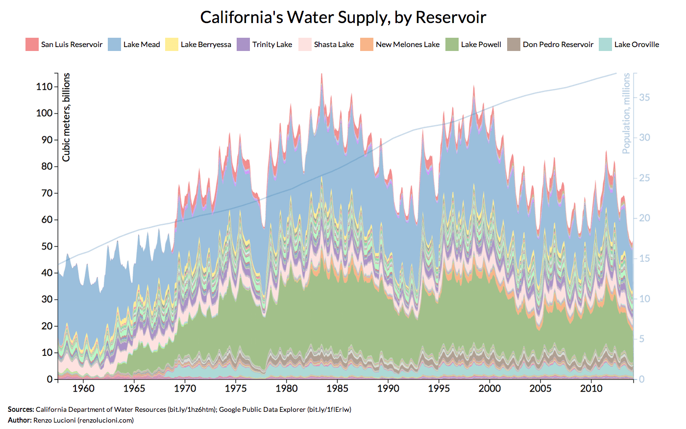

Serving over 30 million people, irrigating more than 5.6 million acres of farmland, and carrying approximately 49 billion cubic meters of water every year, California’s interconnected [water system](https://en.wikipedia.org/wiki/Water_in_California) is the world’s largest and most productive. Lacking reliable dry season rainfall and boasting the largest population of any US state, water is especially limited in California. As a result, water and water rights have become issues of tremendous importance in the state.

California is currently coming off of its warmest winter on record, aggravating an enduring, three-year [dry spell](https://www.reuters.com/article/2014/03/18/us-usa-california-drought-idUSBREA2H03720140318) that threatens to have devastating effects on the state and beyond. Several small communities are at risk of running out of drinking water, and farmers are considering idling a half million acres of farmland, a loss of production that could cause billions of dollars in economic damage.

While I read about it in the news often, I've had trouble putting the situation in California in context. I made this to help me do so.

[Storage](https://water.usgs.gov/wsc/glossary.html#S), measured here in cubic meters (although typically measured in acre-feet), is defined as the amount of water naturally detained in drainage basins and artificially impounded in surface or underground reservoirs, reserved for future use. Every layer in the stacked area graph represents a distinct reservoir. Note that Lake Mead and Lake Powell are not in California. The former is located between Nevada and Arizona while the latter is located between Arizona and Utah. California maintains large, virtual ["water banks"](https://www.reviewjournal.com/news/california-will-tap-its-water-bank-even-as-lake-mead-shrinks/) in each of these reservoirs, making withdrawals as needed.

Declines (i.e., series of increasingly deeper troughs) in the stacked area graph align with California's most recent multi-year [droughts](https://www.water.ca.gov/waterconditions/docs/Drought2012.pdf) of large-scale extent. These droughts stretch from 1959 to 1962, from 1976 to 1977, from 1987 to 1992, from 2000 to 2002, from 2007 to 2009, and from roughly 2011 to the present. The thicknesses of the area graph's layers illustrate the toll these successive droughts and an increasing population have taken on each reservoir the state uses.

Observing these drastic declines in the state's water supply is eye-opening in its own regard, but comparing the state's population to the water supply during each of these droughts takes it to another level. For example, compare the population and water supply during the 1976-1977 drought. Now compare the current population and water supply. This exercise does a good job of putting the severity of the current situation in context.

In order to create this graph, I first used [Beautiful Soup](https://www.crummy.com/software/BeautifulSoup/) to scrape every end-of-month reservoir [storage measurement](https://cdec.water.ca.gov/misc/monthly_res.html) provided by the [California Department of Water Resources](https://en.wikipedia.org/wiki/California_Department_of_Water_Resources) (DWR) for each of California's 191 reservoirs. Using D3, I then created the stacked area graph you see in the visualization. The layers are colored by hashing each reservoir's unique 3-letter identifier to a hex color code, a technique inspired by Fernanda Viégas and Martin Wattenberg's [History Flow](http://hint.fm/projects/historyflow/) project, designed for visualizing Wikipedia edits. The DWR's data is most complete beginning in July 1957, a year after the department was created, which is why I chose to begin the area graph there.[^6] Finally, I used data from the [Google Public Data Explorer](https://www.google.com/publicdata/explore?ds=kf7tgg1uo9ude_&met_y=population&hl=en&dl=en&idim=state:06000:48000#!ctype=l&strail=false&bcs=d&nselm=h&met_y=population&scale_y=lin&ind_y=false&rdim=country&idim=state:06000&ifdim=country&tstart=-411332400000&tend=1342670400000&hl=en_US&dl=en&ind=false) to plot California's population over the area graph.

My code and all associated data are available on [GitHub](https://github.com/rlucioni/viz/tree/master/water).

A modified version of this visualization, shown below, was published by *The Economist* in an article on its [Graphic Detail](https://www.economist.com/blogs/graphicdetail/2014/04/daily-chart-10) blog.

