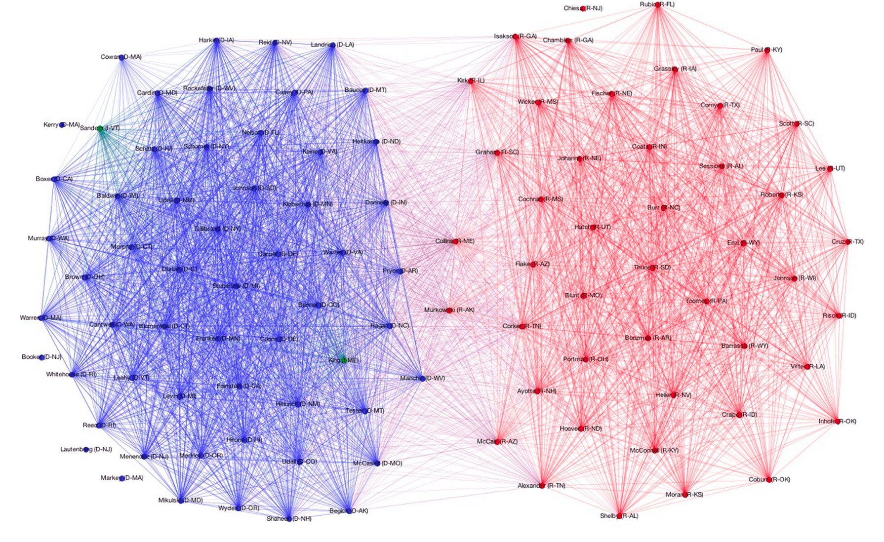

> Though America’s political polarisation has become a fact of life, it has never been seen so graphically: as a diseased brain, with few neural pathways between the two hemispheres.
>
> _The Economist_, December 7 issue

Using voting data from the 101st Congress through the 113th Congress, I created a series of network visualizations like the one below showing voting relationships between US senators.

This image and twenty-four others like it can be found in this [album](https://imgur.com/a/Wmoex#0). I used these visualizations to create an [animation](https://www.gfycat.com/FloweryDirtyGermanshorthairedpointer) which appears to illustrate a widening gap between Democratic and Republican senators.

> This work was inspired by a problem set from Harvard's Data Science course, CS109. Out of respect for the instructors and students taking the course in the future, I've refrained from publishing the problem set itself. Instead, I've abstracted out only the code I wrote and used to scrape Senate roll calls and build NetworkX graphs with that data.

I made the graphs using roll call data from [GovTrack](https://www.govtrack.us/data/congress/), scraped and built into [NetworkX](https://networkx.github.io/) graphs with the code in this [Gist](https://gist.github.com/rlucioni/8bdb1092579041ce739c); I then used [Gephi](https://gephi.org/) to render the NetworkX graphs. In each graph, edge (_u_, _v_) is assigned weight equal to the number of times Senator _u_ and Senator _v_ voted the same way, either Yea or Nay. For the sake of clarity, I filtered out edges with weight less than 100; these lighter edges generally indicate agreement on procedural votes.

The clusters you see in each graph are the result of using Gephi's Force Atlas layout, which applies a force-directed algorithm to the graph and causes those nodes connected by heavier edges to be pulled together more tightly. A nice side-effect of using this physics-based model is that more bipartisan senators are pushed closer to the center of the graph, near the party divide, while less bipartisan senators are repelled outwards toward the perimeter of the graph, furthest from the party divide.

These network visualizations were featured on [Yahoo](https://news.yahoo.com/the-splitting-of-the-senate--now-in-convenient-gif-form-213908185.html). _The Economist_ then picked up the story, running [this short piece](https://www.economist.com/news/united-states/21591190-united-states-amoeba?frsc=dg%7Ca) in the print edition of the magazine dated December 7, 2013.
