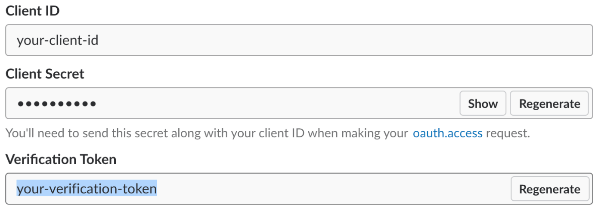
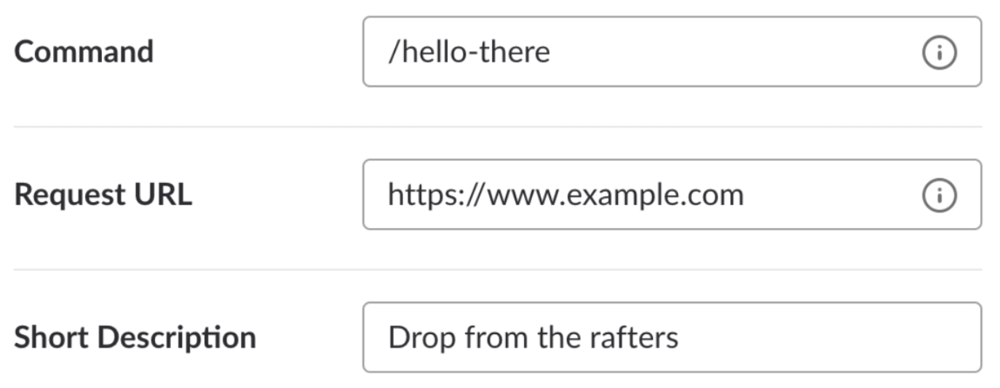
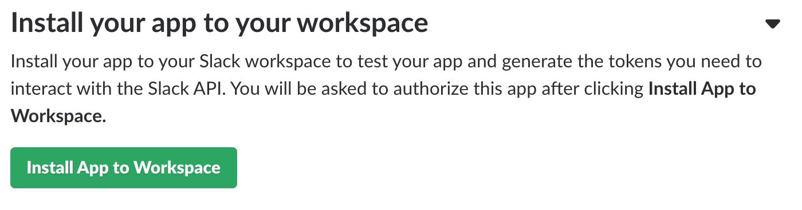
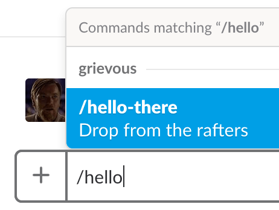
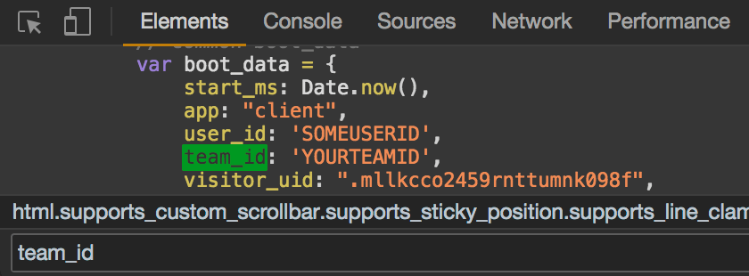
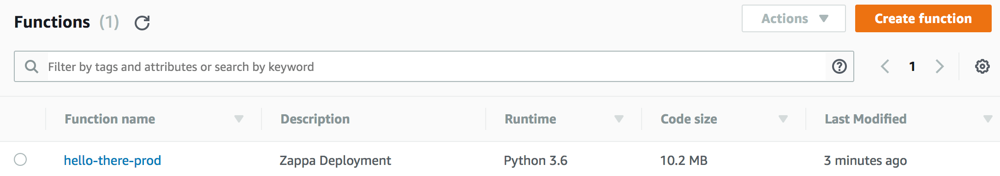
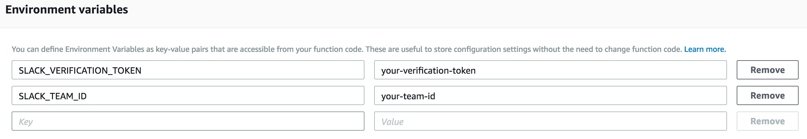
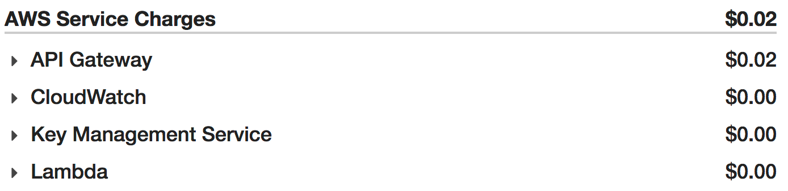
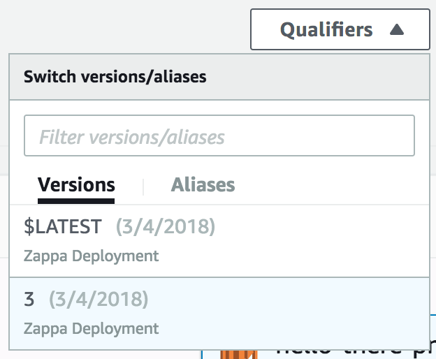
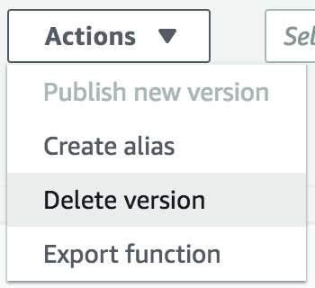

Slack's [slash commands](https://api.slack.com/slash-commands) allow you to perform actions by typing commands into Slack. Custom slash commands are a nice way to add your own functionality to Slack. Here's a way to build them with Python, host them for pennies a month on AWS Lambda, and use these same tools to issue [delayed responses](https://api.slack.com/slash-commands#delayed_responses_and_multiple_responses) when creating long-running commands.

## Setup

Custom slash commands require a [Slack app](https://api.slack.com/slack-apps). To get started, go [here](https://api.slack.com/slack-apps) to create one. Once you've created it, scroll down to the "App Credentials" section and make note of your app's verification token, shown highlighted below. You'll need it later.



You're going to create a command invoked with `/hello-there` which responds with ["General Kenobi!"](https://youtu.be/frszEJb0aOo) whenever the command is run. Navigate to the "Slash Commands" section and click "Create New Command." Fill in the information shown below and save the form.



The Request URL you're providing here is a placeholder. You'll come back and update it soon. For now, the last step is to install the app in your Slack workspace. Go back to your app's "Basic Information" page, click "Install App to Workspace," and authorize the app.



You should now be able to open Slack and see your slash command autocomplete as you type `/hello`.



Sadly, your command doesn't respond the way you want it to yet. Let's change that.

## Development

You'll use [Flask](http://flask.pocoo.org/) to implement a simple backend for your slash command. Start by creating a virtual environment, activating it, and installing Flask. I happen to use [`pyenv`](https://github.com/yyuu/pyenv) and manage my virtualenvs with [`pyenv-virtualenv`](https://github.com/yyuu/pyenv-virtualenv).

```txt
$ pyenv virtualenv 3.6.4 hello-there
$ pyenv local hello-there
(hello-there)$ pip install flask
```

Creating a virtualenv for new projects is generally a good idea. It's especially important here because you're going to use it to make sure that your app's dependencies are shipped to AWS Lambda. More on that later.

Now let's write the backend for your command. The backend needs to do 3 things: receive a POST request, verify that the request was issued by Slack, and respond with the desired message. Here's how that might look, in a file called `hello-there.py`.

```python
import os

from flask import abort, Flask, jsonify, request

app = Flask(__name__)

def is_request_valid(request):
    is_token_valid = request.form['token'] == os.environ['SLACK_VERIFICATION_TOKEN']
    is_team_id_valid = request.form['team_id'] == os.environ['SLACK_TEAM_ID']

    return is_token_valid and is_team_id_valid

@app.route('/hello-there', methods=['POST'])
def hello_there():
    if not is_request_valid(request):
        abort(400)

    return jsonify(
        response_type='in_channel',
        text='<https://youtu.be/frszEJb0aOo|General Kenobi!>',
    )
```

`SLACK_VERIFICATION_TOKEN` is your app's verification token from before. `SLACK_TEAM_ID` is exactly what it sounds like. A quick way to find your Slack team ID is to open the Slack web client in your browser, inspect the source using the dev tools, and search for `team_id`.



See Slack's [command validation](https://api.slack.com/slash-commands#validating_the_command) docs for more details about what's going on in `is_request_valid()`. See the [link formatting](https://api.slack.com/docs/message-formatting#linking_to_urls) docs for more information about the format of your message.

Run the app like you would any other Flask app while exporting the environment variables it needs.

```txt
(hello-there)$ export SLACK_VERIFICATION_TOKEN=your-verification-token
(hello-there)$ export SLACK_TEAM_ID=your-team-id
(hello-there)$ export FLASK_APP=hello-there.py
(hello-there)$ flask run
```

The app will run on port 5000 by default. If you have [ngrok](https://ngrok.com/) installed, you can test the command from Slack at this point. Leave the server running and start ngrok in a separate process.



Copy the HTTPS forwarding URL. In your browser, navigate back to your app's "Slash Commands" section. Edit the command you created earlier, replacing the Request URL with the ngrok forwarding URL and the path to your app's `/hello-there` endpoint, as shown below.


Save your change, then try invoking the command in Slack. You should see something like the following.


It works! Time to ship it.

## Deployment

Slash commands are event-driven by nature. As such, they lend themselves well to serverless deployment. In other words, the server running the backend for your slash commands doesn't need to be running all the time. If it was, you'd end up paying for a server that spent most of its time doing nothing. Services like AWS Lambda are a cheap and convenient way to run small, event-driven apps like this one.

You're going to use a Python framework called [Zappa](https://github.com/Miserlou/Zappa) to deploy your Flask app to Lambda. Zappa creates a Lambda function containing your Flask app and sets up a wildcard API Gateway route to proxy requests from Slack to the app. This allows the app to use Flask's regular URL routing as if you were running it locally or in a more traditional setting. To get started, install Zappa.

```txt
(hello-there)$ pip install zappa
```

If you haven't already, create a local [AWS credentials file](https://aws.amazon.com/blogs/security/a-new-and-standardized-way-to-manage-credentials-in-the-aws-sdks/) (e.g., `~/.aws/credentials`). Zappa needs this file to sign requests to AWS.

Now let's define a simple Zappa settings file called `zappa_settings.json`.

```json
{
  "prod": {
    "app_function": "hello-there.app",
    "aws_region": "us-east-1",
    "exclude": [
      "__pycache__",
      ".git/*",
      ".gitignore",
      ".python-version",
      "LICENSE",
      "README.md",
      "requirements.txt",
      "zappa_settings.json"
    ],
    "keep_warm": true,
    "keep_warm_expression": "rate(5 minutes)",
    "memory_size": 128,
    "profile_name": "default",
    "project_name": "hello-there",
    "runtime": "python3.6",
    "s3_bucket": "hello-there",
    "timeout_seconds": 30
  }
}
```

These settings tell Zappa where to find your app, what you want to prevent from being uploaded to AWS, and how to configure the resulting Lambda function. The `keep_warm` setting tells Zappa whether you want it to set up a recurring no-op that keeps your app function warm. This prevents the function from wasting valuable seconds cold-starting and hitting Slack's 3-second [slash command timeout](https://api.slack.com/slash-commands#responding_to_a_command).

With your settings file in place, you're ready to deploy your app to AWS. Do so as follows.

```txt
(hello-there)$ zappa deploy prod
```

This tells Zappa to zip up your code and virtualenv, upload the package, create a new Lambda function, and create a new API Gateway route pointing to the function. Wait a few moments for all this to happen and your app should be deployed! Head over to the AWS console in your browser, navigate to the Lambda service, and you should see your new function listed.



Click into the function and scroll down to configure the app's environment variables.



Don't forget to click "Save" in the upper-right. All you need to do now is tell Slack to send POST requests to your newly-deployed app. You need to replace the ngrok forwarding URL from earlier with your app's new API Gateway URL. To find it, run the following for details about your deployment.

```txt
(hello-there)$ zappa status prod
Status for hello-there-prod:
    Lambda Versions:      2
    Lambda Name:          hello-there-prod
    Lambda ARN:           arn:aws:lambda:us-east-1:635361345619:function:hello-there-prod
    Lambda Role ARN:      arn:aws:iam::635361345619:role/hello-there-prod-ZappaLambdaExecutionRole
    Lambda Handler:       handler.lambda_handler
    Lambda Code Size:     10720718
    Lambda Version:       $LATEST
    Lambda Last Modified: 2018-03-05T01:35:46.933+0000
    Lambda Memory Size:   128
    Lambda Timeout:       30
    Lambda Runtime:       python3.6
    Lambda VPC ID:        None
    Invocations (24h):    0
    Errors (24h):         0
    Error Rate (24h):     0.00%
    API Gateway URL:      https://f5y9jiq8s3.execute-api.us-east-1.amazonaws.com/prod
    Domain URL:           None Supplied
    Num. Event Rules:     1
    Event Rule Name:      hello-there-prod-zappa-keep-warm-handler.keep_warm_callback
    Event Rule Schedule:  rate(5 minutes)
    Event Rule State:     Enabled
    Event Rule ARN:       arn:aws:events:us-east-1:635361345619:rule/hello-there-prod-zappa-keep-warm-handler.keep_warm_callback
```

Copy the API Gateway URL. Then, just like before, navigate back to your app's "Slash Commands" section in your browser and edit the configuration of the `/hello-there` command, replacing the ngrok forwarding URL with the API Gateway URL.


Remember to leave the `/hello-there` portion of the path intact so that Slack POSTs to the right endpoint. Save your change, then try invoking the command in Slack again. Your app should respond, just like when it was running locally. If it doesn't, tail the function's logs to figure out what's going wrong.

```txt
(hello-there)$ zappa tail prod --since 1h
```

Assuming your app responds successfully, congratulations! You've created your own slash command.

## Delayed Responses

Slack requires that "in channel" slash commands receive a response [within 3 seconds](https://api.slack.com/slash-commands#responding_to_a_command). Your app is already using Zappa's [keep-warm](https://github.com/Miserlou/Zappa#keeping-the-server-warm) feature to combat cold-start and keep its response times under this limit. Here's how you can implement a command that takes longer than 3 seconds to complete using Zappa's [asynchronous task execution](https://github.com/Miserlou/Zappa#asynchronous-task-execution) feature. This section doubles as an example of how to update the code your deployed function is running.

To be more faithful to the scene from Revenge of the Sith, you now want your `/hello-there` command to respond with ["General Kenobi!"](https://youtu.be/frszEJb0aOo), followed 5 seconds later by "You _are_ a bold one." Your command's backend has to do more work now: receive a POST request, verify that the request was issued by Slack, schedule a task that will issue the second message 5 seconds in the future, and respond immediately with the first message. Here's how you might change your implementation of `hello-there.py` to achieve this.

```python
import os
from time import sleep

import requests
from flask import abort, Flask, jsonify, request
from zappa.async import task

app = Flask(__name__)

def is_request_valid(request):
    is_token_valid = request.form['token'] == os.environ['SLACK_VERIFICATION_TOKEN']
    is_team_id_valid = request.form['team_id'] == os.environ['SLACK_TEAM_ID']

    return is_token_valid and is_team_id_valid

@task
def hello_there_task(response_url):
    sleep(5)

    data = {
        'response_type': 'in_channel',
        'text': 'You _are_ a bold one.',
    }

    requests.post(response_url, json=data)

@app.route('/hello-there', methods=['POST'])
def hello_there():
    if not is_request_valid(request):
        abort(400)

    hello_there_task(request.form['response_url'])

    return jsonify(
        response_type='in_channel',
        text='<https://youtu.be/frszEJb0aOo|General Kenobi!>',
    )
```

The `@task` decorator tells Zappa to run `hello_there_task()` asynchronously as a separate, one-off Lambda function. As a result, `hello_there_task()` should return immediately in spite of the blocking, 5-second sleep. When run locally, the task will execute synchronously.

Let's deploy and test these changes. The following command tells Zappa that you want to upload new Python code, but that you don't need to touch existing API Gateway routes.

```txt
(hello-there)$ zappa update prod
```

Wait a few moments for your Lambda function to update. An update like this won't change your function's API Gateway URL, so you don't need to touch your slash command configuration again. Once the update completes, try invoking your command in Slack a final time. Here's how it should look, in real time.

<video src="hello-there.mp4" muted autoplay loop></video>

Awesome!

## Tips

I'll end with a few additional tips.

### Slash Command Best Practices

Slack lists a variety of slash command [best practices](https://api.slack.com/slash-commands#best_practices) in their docs. Two in particular have served me well.

First, provide a help action that explains your command's usage. For example, look for the word `help` in the request's `text` parameter and respond accordingly.

Second, try to acknowledge receipt of commands by responding immediately, even if the command hasn't completed yet. This is especially important if the command will take some time to run. An immediate response lets your users know that their request was received and is being acted on.

### Cost

You're probably wondering how much this costs. Here's the February 2018 bill for an app of mine that backs a handful of slash commands similar to your `/hello-there` command.



Not bad! I'm able to keep the cost low by taking advantage of Lambda's [free tier](https://aws.amazon.com/lambda/pricing/#Lambda_pricing_details). The 128 MB memory size requested in `zappa_settings.json` is the smallest available and allows functions to run for a total of 3.2 million free seconds each month.

### Lambda Versioning

Every time you update a function, a new version of it is created. AWS keeps old versions around unless you delete them. Zappa won't delete old versions for you.

Things can get messy if you leave lots of old function versions lying around. It also means you're leaving old deployment packages around. AWS [limits](https://docs.aws.amazon.com/lambda/latest/dg/limits.html#limits-list) the total size of all deployment packages that can be uploaded per region, though you're unlikely to hit the limit.

To clean up function versions manually, navigate to the AWS console. Select the version you want to delete.



Then click "Delete version" from the menu.



It's possible to [automate](https://github.com/rlucioni/courtbot/blob/master/prune.py) this, but chances are you probably won't need to do it often.

### Cron Jobs

Need your app to run scheduled tasks? Zappa's [function scheduling](https://github.com/Miserlou/Zappa/#scheduling) has you covered, making it easy to create CloudWatch Events that can trigger arbitrary functions using [cron or rate syntax](https://docs.aws.amazon.com/lambda/latest/dg/tutorial-scheduled-events-schedule-expressions.html).

### Teardown

If you want to delete everything you deployed here from AWS, Zappa's [undeploy command](https://github.com/Miserlou/Zappa#undeploy) also has you covered.

```txt
(hello-there)$ zappa undeploy prod
```

This deletes your Lambda function, its accompanying API Gateway route, and any CloudWatch Events. You'll be asked to confirm before it runs.

## Examples

All of the code covered here is on [GitHub](https://github.com/rlucioni/hello-there).

If you want to see a more complete example that includes help actions, asynchronous tasks, and scheduled tasks, check out my [courtbot](https://github.com/rlucioni/courtbot) project.
